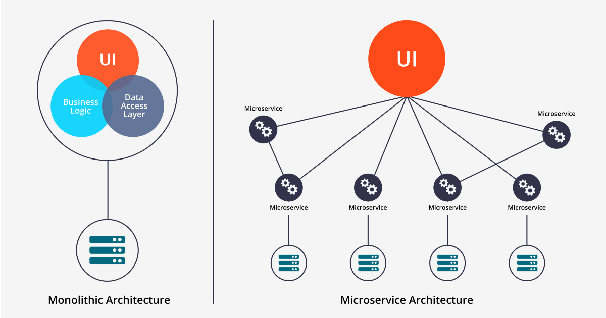
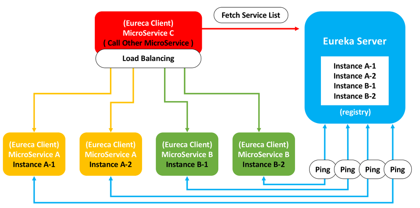
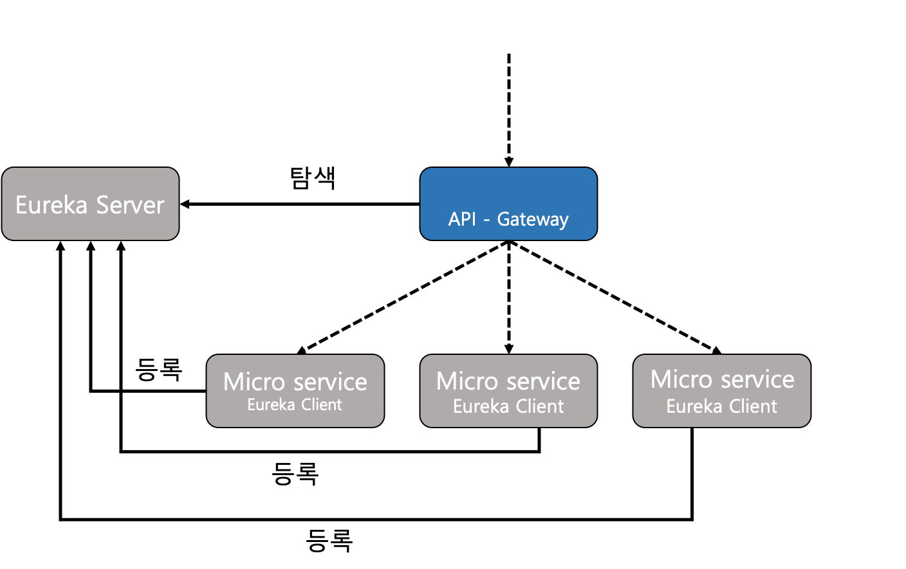

# Spring Cloud Netflix
- Spring Cloud Netflix를 사용하여 MSA 아키텍처 형식의 서비스 샘플코드 구현 레포지토리

## 학습 목표
- MSA와 모놀로식 아키텍처에 대해서 전반적으로 이해하고 Spring Cloud Netflix 프레임워크를 통해 MSA 아키텍처 형식의 서비스를 구현을 통한 학습

## Spring Cloud Netflix란?

[출처 : https://spring.io/projects/spring-cloud-netflix]  

- Spring Cloud Netflix는 자동 구성 및 Spring Environment와 다른 Spring 프로그래밍 모델 관용어에 대한 바인딩을 통해 Spring Boot 앱에 Netflix OSS 통합을 제공합니다. 몇 가지 간단한 주석을 사용하면 애플리케이션 내부의 일반적인 패턴을 빠르게 활성화하고 구성하고 실전에서 테스트된 Netflix 구성 요소로 대규모 분산 시스템을 구축할 수 있습니다. 제공되는 패턴에는 Service Discovery(Eureka)가 포함됩니다.

## MSA 란?
- 마이크로서비스 아키텍처(MSA)는 작고 독립적인 서비스들의 집합으로 구성된 애플리케이션 구조이다. 반대로 하나의 서비스 또는 애플리케이션이 하나의 거대한 아키텍처를 가진 모놀로식 아키텍처가 있다.  
  
  [출처 : https://hahahoho5915.tistory.com/71]
  

## Spring Cloud Netflix구조
- MSA 서비스를 구성하기 위해 Spring Cloud Netflix의 전반적인 것을 아래 그림을 통해 알수 있다.  
[출처 : https://lion-king.tistory.com/entry/Spring-Boot-Spring-Cloud-MSA-3-Eureka%EB%9E%80-%EC%A0%81%EC%9A%A9%EB%B0%A9%EB%B2%95]
  
  
  [출처 : https://taes-k.github.io/2019/06/13/spring-msa-2/]
  
Eureka Server를 만들고 해당 Eureka Server에 Eureka Client(마이크로서비스)들을 등록한다. 그리고 GateWay(마이크로서비스) 또한 Eureka Server에 등록후 브라우저와 같은 클라이언트는 서버에 요청할때 GateWay(마이크로서비스)에게만 요청을하여 응답을 받는다.

## MSA의 등장 배경
- 모놀로식 아키텍처  는 하나의 프로젝트 내에 모든 서비스가 있는 구조입니다. 따라서 초기 개발상태일때는 개발, 리소스 공유, 배포, 테스트 등 다양한 면에서 용이하지만, 하나의 하나의 프로젝트 내에 모든 서비스가 있기에 프로젝트가 커질수록 부담이 생길 수 밖에 없습니다.  
  
  1. 유연성과 확장성 부족: 모놀로식 아키텍처  는 규모가 커질수록 복잡해지며, 특정 부분만을 확장하기 어렵습니다. 반면, MSA 는 각 서비스를 독립적으로 확장하고 관리할 수 있어, 시스템의 유연성과 확장성을 크게 향상시킵니다.

  2. 개발 속도 저하: 모놀로식 아키텍처 에서는 애플리케이션의 모든 부분이 서로 밀접하게 연결되어 있어, 작은 변경사항 하나에도 전체 시스템을 다시 테스트하고 배포해야 할 수 있습니다. MSA 는 독립적으로 배포 가능하므로, 더 빠른 개발과 반복이 가능합니다.

  3. 기술 스택의 유연성 부족: 모놀로식 아키텍처  는 일반적으로 단일 기술 스택에 종속됩니다. MSA 는 각 서비스가 서로 다른 기술 스택을 사용할 수 있어, 새로운 기술을 채택하거나 최적의 기술을 선택하는 데 더 유연합니다.

  4. 복잡한 확장 문제: 모놀로식 아키텍처  에서는 전체 애플리케이션을 확장해야 하며, 이는 비용과 리소스 측면에서 비효율적일 수 있습니다. MSA 는 필요한 서비스만을 타겟으로 확장할 수 있어 효율성이 높습니다.

  5. 장애의 영향 최소화: 모놀로식 아키텍처  에서 한 부분의 실패는 전체 시스템에 영향을 줄 수 있습니다. MSA 는 서비스간의 격리를 통해 장애가 전체 시스템에 미치는 영향을 최소화합니다.

  6. 팀의 독립성: 모놀로식 아키텍처  은 팀 간의 의존성을 증가시킵니다. MSA 는 각 팀이 자신의 서비스에 집중할 수 있게 하여, 더 빠르고 효율적인 개발을 가능하게 합니다.

  위와 같은 모놀로식 아키텍처의 문제점에 의해 MSA 아키텍처가 등장된것이다.

## MSA의 문제점
- MSA 아키텍처의 문제점으로는 아래항목과 같다.
1. 설계의 어려움  
   - MSA는 모놀리식에 비해 상대적으로 많이 복잡하다. 서비스가 모두 분산되어 있기 때문에 개발자는 내부 시스템의 통신을 어떻게 가져가야 할지 정해야합니다. 또한, 통신의 장애와 서버의 부하 등이 있을 경우 어떻게 transaction을 유지할지 결정하고 구현해야합니다.
 
2. 성능
   - 서비스 간 호출 시 API를 사용하므로, 통신 비용이나 Latency에 대해 이슈가 존재합니다.

3. 테스트/데이터 트랜잭션
   - 모놀리식에서는 단일 트랜잭션을 유지하면 됐지만 MSA에서는 비즈니스에 대한 DB를 가지고 있는 서비스도 각기 다르고, 서비스의 연결을 위해서는 통신이 포함되기 때문에 트랜잭션을 유지하는게 어렵습니다.- 통합 테스트가 어렵습니다. 개발 환경과 실제 운영환경을 동일하게 가져가는 것이 쉽지 않습니다.
 
4. 데이터 관리
   - 데이터가 여러 서비스에 분산되어 있어 조회하기 어렵습니다.
   - 데이터를 관리하기 어렵습니다.

## 문제점 해결방법
- 위에 문제점에서 손꼽히는 데이터 관리 및 데이터 트랜잭션의 문제는 Kafka & Kafka Connect의 미들웨어를 활용한 프로세스간 비동기 통신이 있다.

## Kafka & Kafka Connect
- [해당 링크 참고](https://github.com/Developer-Choi-Jae-Young/KafkaTest)

## 브렌치 설명
 - docker
    * Kafka & Kafka Connect 개발환경 구성요소
 - EurekaServer
    * Eureka Server(마이크로서비스 유레카 서버)
 - firstService
    * 마이크로서비스1
 - gateWay
    * 마이크로서비스 게이트웨이
 - secondService
    * 마이크로서비스1