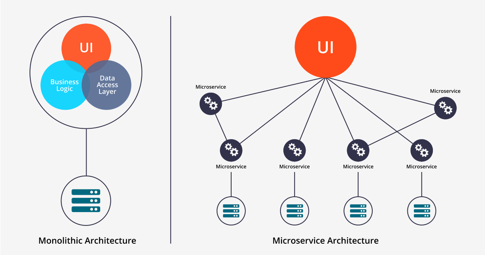
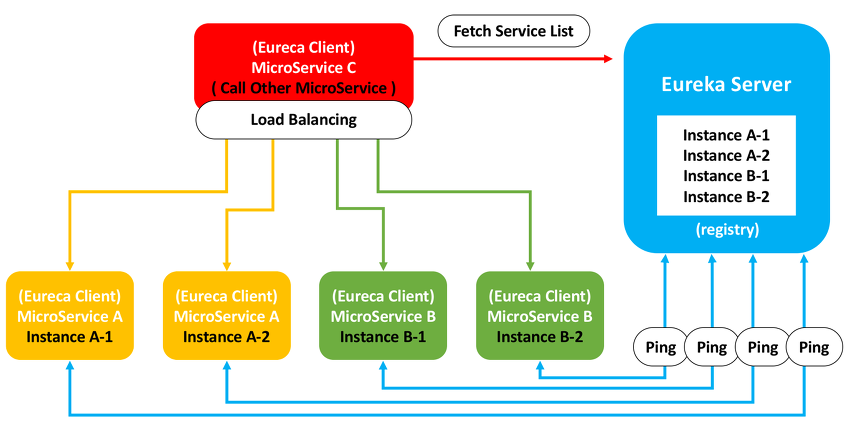
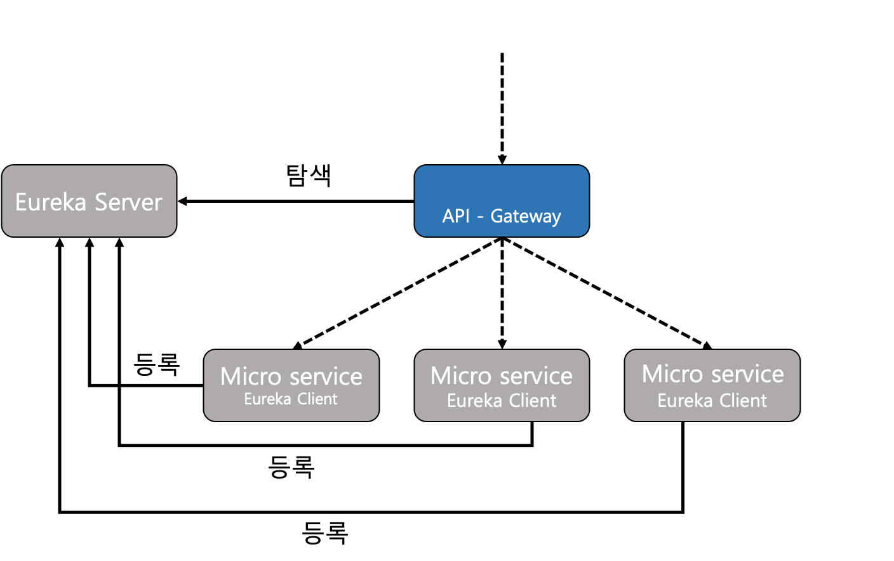

# Spring Cloud Netflix
- Spring Cloud Netflix를 사용하여 MSA 아키텍처 형식의 서비스 샘플코드 구현 레포지토리

## 학습 목표
- MSA와 모놀로식 아키텍처에 대해서 전반적으로 이해하고 Spring Cloud Netflix 프레임워크를 통해 MSA 아키텍처 형식의 서비스를 구현을 통한 학습

## Spring Cloud Netflix란?

[출처 : https://spring.io/projects/spring-cloud-netflix]  

- Spring Cloud Netflix는 자동 구성 및 Spring Environment와 다른 Spring 프로그래밍 모델 관용어에 대한 바인딩을 통해 Spring Boot 앱에 Netflix OSS 통합을 제공합니다. 몇 가지 간단한 주석을 사용하면 애플리케이션 내부의 일반적인 패턴을 빠르게 활성화하고 구성하고 실전에서 테스트된 Netflix 구성 요소로 대규모 분산 시스템을 구축할 수 있습니다. 제공되는 패턴에는 Service Discovery(Eureka)가 포함됩니다.

## MSA 란?
- 마이크로서비스 아키텍처(MSA)는 작고 독립적인 서비스들의 집합으로 구성된 애플리케이션 구조이다. 반대로 하나의 서비스 또는 애플리케이션이 하나의 거대한 아키텍처를 가진 모놀로식 아키텍처가 있다.  
  
  [출처 : https://hahahoho5915.tistory.com/71]
  

## Spring Cloud Netflix구조
- MSA 서비스를 구성하기 위해 Spring Cloud Netflix의 전반적인 것을 아래 그림을 통해 알수 있다.  
[출처 : https://lion-king.tistory.com/entry/Spring-Boot-Spring-Cloud-MSA-3-Eureka%EB%9E%80-%EC%A0%81%EC%9A%A9%EB%B0%A9%EB%B2%95]
  
  
  [출처 : https://taes-k.github.io/2019/06/13/spring-msa-2/]
  
Eureka Server를 만들고 해당 Eureka Server에 Eureka Client(마이크로서비스)들을 등록한다. 그리고 GateWay(마이크로서비스) 또한 Eureka Server에 등록후 브라우저와 같은 클라이언트는 서버에 요청할때 GateWay(마이크로서비스)에게만 요청을하여 응답을 받는다.

## MSA의 등장 배경
- 모놀로식 아키텍처  는 하나의 프로젝트 내에 모든 서비스가 있는 구조입니다. 따라서 초기 개발상태일때는 개발, 리소스 공유, 배포, 테스트 등 다양한 면에서 용이하지만, 하나의 하나의 프로젝트 내에 모든 서비스가 있기에 프로젝트가 커질수록 부담이 생길 수 밖에 없습니다.  
  
  1. 유연성과 확장성 부족: 모놀로식 아키텍처  는 규모가 커질수록 복잡해지며, 특정 부분만을 확장하기 어렵습니다. 반면, MSA 는 각 서비스를 독립적으로 확장하고 관리할 수 있어, 시스템의 유연성과 확장성을 크게 향상시킵니다.

  2. 개발 속도 저하: 모놀로식 아키텍처 에서는 애플리케이션의 모든 부분이 서로 밀접하게 연결되어 있어, 작은 변경사항 하나에도 전체 시스템을 다시 테스트하고 배포해야 할 수 있습니다. MSA 는 독립적으로 배포 가능하므로, 더 빠른 개발과 반복이 가능합니다.

  3. 기술 스택의 유연성 부족: 모놀로식 아키텍처  는 일반적으로 단일 기술 스택에 종속됩니다. MSA 는 각 서비스가 서로 다른 기술 스택을 사용할 수 있어, 새로운 기술을 채택하거나 최적의 기술을 선택하는 데 더 유연합니다.

  4. 복잡한 확장 문제: 모놀로식 아키텍처  에서는 전체 애플리케이션을 확장해야 하며, 이는 비용과 리소스 측면에서 비효율적일 수 있습니다. MSA 는 필요한 서비스만을 타겟으로 확장할 수 있어 효율성이 높습니다.

  5. 장애의 영향 최소화: 모놀로식 아키텍처  에서 한 부분의 실패는 전체 시스템에 영향을 줄 수 있습니다. MSA 는 서비스간의 격리를 통해 장애가 전체 시스템에 미치는 영향을 최소화합니다.

  6. 팀의 독립성: 모놀로식 아키텍처  은 팀 간의 의존성을 증가시킵니다. MSA 는 각 팀이 자신의 서비스에 집중할 수 있게 하여, 더 빠르고 효율적인 개발을 가능하게 합니다.

  위와 같은 모놀로식 아키텍처의 문제점에 의해 MSA 아키텍처가 등장된것이다.

## MSA의 문제점
- MSA 아키텍처의 문제점으로는 아래항목과 같다.
1. 설계의 어려움  
   - MSA는 모놀리식에 비해 상대적으로 많이 복잡하다. 서비스가 모두 분산되어 있기 때문에 개발자는 내부 시스템의 통신을 어떻게 가져가야 할지 정해야합니다. 또한, 통신의 장애와 서버의 부하 등이 있을 경우 어떻게 transaction을 유지할지 결정하고 구현해야합니다.
 
2. 성능
   - 서비스 간 호출 시 API를 사용하므로, 통신 비용이나 Latency에 대해 이슈가 존재합니다.

3. 테스트/데이터 트랜잭션
   - 모놀리식에서는 단일 트랜잭션을 유지하면 됐지만 MSA에서는 비즈니스에 대한 DB를 가지고 있는 서비스도 각기 다르고, 서비스의 연결을 위해서는 통신이 포함되기 때문에 트랜잭션을 유지하는게 어렵습니다.- 통합 테스트가 어렵습니다. 개발 환경과 실제 운영환경을 동일하게 가져가는 것이 쉽지 않습니다.
 
4. 데이터 관리
   - 데이터가 여러 서비스에 분산되어 있어 조회하기 어렵습니다.
   - 데이터를 관리하기 어렵습니다.

## 문제점 해결방법
MSA의 주요 문제점인 서비스 간 데이터 일관성 유지 및 분산 트랜잭션 처리를 해결하기 위해 다양한 아키텍처 패턴과 메시징 미들웨어(Kafka & Kafka Connect 등)를 활용합니다.

---

## 1. MSA 분산 트랜잭션 패턴 (Saga Pattern)
MSA 환경에서는 서비스별 독립적인 DB(Database per Service)를 사용하므로, 단일 DB의 ACID 트랜잭션을 사용할 수 없습니다. 이를 해결하기 위해 연쇄적인 단일 서비스 트랜잭션의 조합으로 전체 트랜잭션을 처리하는 **Saga 패턴**을 사용하며, 중간 실패 시 **보상 트랜잭션(Compensating Transaction)**을 실행하여 데이터 일관성을 맞춥니다.

Saga 패턴은 제어 방식에 따라 **오케스트레이션(Orchestration)**과 **코레오그래피(Choreography)** 구조로 나뉩니다.

### 1) 오케스트레이션 (Orchestration) 구조
중앙의 **오케스트레이터(Orchestrator) 서비스**가 전체 비즈니스 트랜잭션 흐름을 주도하고, 각 마이크로서비스에게 어떤 작업을 수행해야 하는지 중앙에서 직접 명령을 내리고 응답을 받는 방식입니다.

- **동작 방식**:
  1. 클라이언트 요청 수신 시, 오케스트레이터가 Service A에게 작업 요청
  2. Service A 완료 응답 후, 오케스트레이터가 Service B에게 다음 작업 요청
  3. 중간 단계(예: Service B)에서 실패 발생 시, 오케스트레이터가 이미 성공한 이전 서비스(Service A)에 보상 트랜잭션 명령 전달

- **장점**:
  - **흐름 파악 용이**: 트랜잭션의 상태와 전체 비즈니스 로직을 오케스트레이터 한곳에서 쉽게 추적 및 관리할 수 있습니다.
  - **순환 의존성 방지**: 서비스 간 직접 호출이 없어 복잡한 얽힘(Circular Dependency)을 줄입니다.
  - **테스트 및 디버깅**: 비즈니스 로직 흐름 파악이 명확하여 디버깅이 수월합니다.

- **단점**:
  - **중앙 집중화**: 오케스트레이터에 비즈니스 로직이 지나치게 집중될 경우, 오케스트레이터 자체가 거대한 모놀리식이 될 위험(Smart Endpoints)이 있습니다.
  - **단일 장애 지점(SPOF)**: 오케스트레이터 다운 시 전체 트랜잭션 진행이 마비될 수 있습니다.

---

### 2) 코레오그래피 (Choreography) 구조
중앙의 제어자 없이, 각 마이크로서비스가 작업 완료 후 **이벤트를 발행(Publish)**하고 타 서비스가 해당 이벤트를 **구독(Subscribe)**하여 자율적으로 다음 트랜잭션을 수행하는 방식입니다.

- **동작 방식**:
  1. Service A가 자신의 DB 트랜잭션 완료 후 `ServiceACompleted` 이벤트 발행
  2. Service B가 이벤트를 수신하여 자체 로직 처리 후 `ServiceBCompleted` 이벤트 발행
  3. 실패 발생 시 해당 서비스가 실패 이벤트를 발행하고, 이전에 이벤트를 처리했던 서비스들이 이를 구독하여 보상 트랜잭션 수행

- **장점**:
  - **낮은 결합도(Decoupling)**: 중앙 컨트롤러 없이 서비스 간 직접적인 의존성을 제거하여 독립적 배포 및 확장에 유용합니다.
  - **높은 자율성**: 구조가 단순한 소규모 MSA 시스템이나 이벤트 기반 시스템 구축에 용이합니다.

- **단점**:
  - **전체 흐름 추적의 어려움**: 서비스가 많아질수록 어떤 서비스가 어떤 이벤트를 소비하고 처리하는지 전체 트랜잭션 상태를 파악하기 어렵습니다.
  - **순환 참조 위험**: 이벤트가 고리처럼 꼬여 복잡한 의존 관계나 무한 루프가 발생할 수 있습니다.

---

## 2. 데이터 일관성을 위한 패턴 (Outbox & CDC)

분산 환경에서 데이터베이스에 데이터를 저장함과 동시에 메시지 브로커(Kafka 등)에 이벤트를 발행할 때, 둘 중 하나만 성공하는 **Dual Write(이중 기입) 문제**가 발생할 수 있습니다. 이를 해결하기 위한 핵심 패턴들입니다.

### 1) 트랜잭션 아웃박스 패턴 (Transaction Outbox Pattern)
비즈니스 데이터 저장과 이벤트 발행 작업을 **단일 로컬 DB 트랜잭션**으로 묶어 데이터 유실을 방지하는 패턴입니다.

- **동작 방식**:
  1. 애플리케이션은 비즈니스 데이터(예: 주문 생성)를 DB에 저장할 때, 발행할 이벤트 메시지를 동일한 DB 내 **`Outbox` 테이블**에 함께 `INSERT` 합니다.
  2. DB의 로컬 트랜잭션 특성 덕분에 비즈니스 데이터와 Outbox 이벤트 데이터는 100% 동일한 ACID 트랜잭션으로 저장됩니다.
  3. 별도의 프로세스(Relay)가 Outbox 테이블을 읽어 메시지 브로커로 전송합니다.

---

### 2) CDC (Change Data Capture)
데이터베이스의 상태 변경(INSERT, UPDATE, DELETE)을 실시간으로 감지하여 타깃 시스템(Kafka 등)으로 이벤트를 스트리밍하는 기술입니다.

- **특징**:
  - **DB 바이너리 로그(Binlog / WAL) 활용**: DB 쿼리를 통해 Polling 하는 방식이 아니라, DB 트랜잭션 로그를 직접 스캔하므로 DB에 조회 부하를 주지 않습니다.
  - **저지연(Low Latency)**: 데이터 변경 직후 즉시 이벤트를 감지 및 처리할 수 있습니다.
  - **대표 도구**: Debezium, Canal, AWS DMS 등.

---

## 3. 현업 실무 구조: Transaction Outbox + CDC 아키텍처

현업에서는 **Transaction Outbox 패턴의 정합성 보장** 능력과 **CDC의 저지연/무부하 로그 스캐닝** 능력을 조합한 **Outbox + CDC 아키텍처**를 가장 표준적으로 사용합니다.

```
[Client] 
   │
   ▼
[Microservice App] ────(1. Local DB Transaction)────► [Database]
 (Business Logic)                                      ├── Business Table (INSERT)
                                                       └── Outbox Table (INSERT)
                                                               │
                                                       (2. Write-Ahead Log / Binlog)
                                                               │
                                                               ▼
                                                      [CDC Engine (Debezium)]
                                                               │
                                                       (3. Event Publish)
                                                               │
                                                               ▼
                                                      [Kafka Message Broker]
                                                               │
                                                               ▼
                                                      [Other Microservices]
```

### 처리 흐름
1. **단일 트랜잭션 처리 (App)**
   - 마이크로서비스는 비즈니스 로직 수행 시 비즈니스 테이블 업데이트와 함께 `Outbox` 테이블에 이벤트를 추가하고 **하나의 DB 트랜잭션**으로 `COMMIT` 합니다.
2. **DB 로그 기록 (Database)**
   - 트랜잭션이 성공하면 DB의 트랜잭션 로그(MySQL Binlog, PostgreSQL WAL 등)에 변경 사항이 남아 100% 데이터 일관성이 보장됩니다.
3. **변경 감지 및 캡처 (CDC Engine)**
   - CDC 도구(Debezium 등)가 DB의 트랜잭션 로그를 비동기로 스캔하여 `Outbox` 테이블에 새로 추가된 데이터만 실시간으로 캡처합니다.
4. **메시지 발행 (Kafka)**
   - CDC 커넥터가 캡처한 Outbox 이벤트를 Kafka 토픽으로 안전하게 발행합니다.
5. **이벤트 소비 (Consumer Services)**
   - 타 마이크로서비스들이 Kafka 토픽을 구독하여 비동기로 다음 작업을 수행합니다.

### 이 구조를 현업에서 사용하는 이유
1. **Dual Write 문제 완벽 해결 (At-Least-Once 보장)**
   - DB 트랜잭션에만 성공하면 이벤트는 무조건 저장되며, Kafka 장애 시에도 안전하게 보관되어 추후 전송됩니다.
2. **DB 성능 부하 최소화**
   - 기존 Polling 방식(`SELECT ... WHERE status='READY'`)과 달리 DB 트랜잭션 로그를 직접 읽으므로 DB CPU 및 Memory 부하가 거의 없습니다.
3. **애플리케이션 결합도 및 복잡도 감소**
   - 애플리케이션 코드는 Kafka 클라이언트 연결/재시도 로직을 직접 관리할 필요 없이 DB 저장에만 집중할 수 있습니다.

---

## Kafka & Kafka Connect
- [해당 링크 참고](https://github.com/Developer-Choi-Jae-Young/KafkaTest)

## 브렌치 설명
 - docker
    * Kafka & Kafka Connect 개발환경 구성요소
 - EurekaServer
    * Eureka Server(마이크로서비스 유레카 서버)
 - firstService
    * 마이크로서비스1
 - gateWay
    * 마이크로서비스 게이트웨이
 - secondService
    * 마이크로서비스1